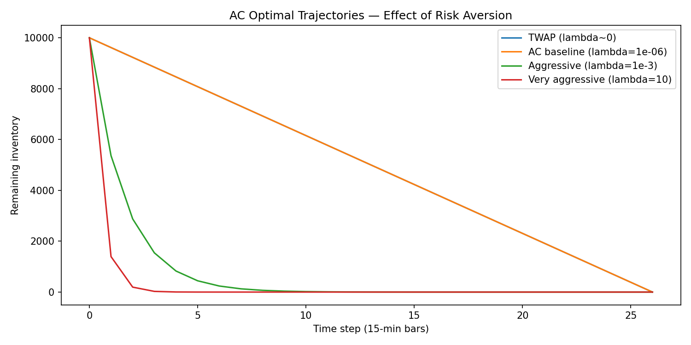

# Experiment 01: AC Optimal Trajectories

Run: `python -m experiments.ac_trajectory.run`

## Setup

- X=10,000 shares, T=26 bars (one trading day at 15-min resolution)
- sigma=0.0623 (calibrated OU long-run mean vol)
- eta=0.01 (temporary impact), gamma=0.001 (permanent impact)
- Four lambda values: ~0 (TWAP), 1e-6, 1e-3, 10.0

## Results

| Lambda | Behavior | Interpretation |
|---|---|---|
| ~0 (TWAP) | Linear | No timing risk penalty |
| 1e-6 | Nearly linear | Slight front-loading, barely visible |
| 1e-3 | Convex, front-loaded | Meaningful timing risk aversion |
| 10.0 | Extremely convex | Nearly all shares sold in first 2 bars |

Expected IS (baseline, lambda=1e-6): 69,232.45

## Analysis

The trajectories confirm the AC model behaves correctly across the full range of risk aversion. At lambda~0 the solution recovers TWAP (equal shares each period, no urgency). As lambda increases, the optimal policy becomes increasingly convex: the agent front-loads execution to reduce inventory exposure to price risk, accepting higher temporary impact costs in exchange for certainty.

The effect is nonlinear. The jump from lambda=1e-3 to lambda=10 is far more dramatic than from lambda=1e-6 to lambda=1e-3, reflecting the sinh curve's sensitivity to kappa = sqrt(lambda * sigma^2 / eta). At lambda=10, nearly all 10,000 shares are executed in the first two bars. The agent essentially dumps the position immediately, treating timing risk as catastrophic.

The baseline lambda=1e-6 produces a nearly linear trajectory, close to TWAP but not identical. This is the benchmark all subsequent strategies will be compared against.

## Open Questions

- [ ] What lambda value best matches empirical execution behavior
      observed in real SPY intraday data?
- [ ] At what lambda does the expected IS begin to increase due to
      excessive impact costs from front-loading?